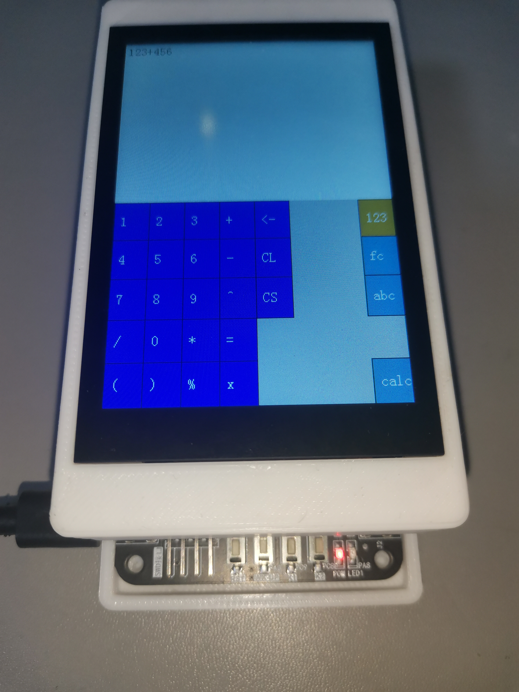

# 自制计算器

## 项目内容

使用STM32RCT6驱动触摸屏运行计算器程序

计算器包含以下功能

1. 基本四则运算、幂运算 、模运算
2. 考虑运算的优先级和结合性、允许无限次括号嵌套
3. 多态运算整数和浮点数
4. 二、八、十、十六进制输入
5. 平方根、三角、对数函数
6. 二分法和牛顿迭代法解方程

说明：

运算多态例如
sqrt(2)的结果为浮点数，sqrt(4)的结果为整数
1/3的结果为浮点数，6/3的结果为整数
函数目前不支持运算多态，均返回浮点数

二分法解方程的精度为32位浮点数的极限精度，即7位有效数字，第七位不一定有效，函数(方程左侧减去方程右侧)必须在二分法的寻根区间内连续，如果函数不穿过x轴但有零点，二分法大概率解不出(例如方程x^2=0)

牛顿迭代法使用差分公式求导，最好情况下的精度为0.001，如果方程不在实数域上可导，可能解不出来或出错

## 使用说明

计算器的各功能详见software/math_core/test部分

## 实物照片



## 项目结构
```
.
├── hardware    硬件
│   ├── document    硬件文档
│   ├── example_from_vendor 厂家例程
│   │   └── stm32rct6-utf8  STM32RCT6触摸屏例程 UTF8编码 MDK工程 底层库
│   │       ├── Demo_MSP3525_MSP3526_STM32F103RCT6_Hardware_SPI 硬件SPI 
│   │       └── Demo_MSP3525_MSP3526_STM32F103RCT6_Software_SPI 软件SPI
│   ├── PCB 插件版的原理图和PCB
│   ├── hardware_spi_screen 触摸屏硬件SPI UTF8编码 Makefile工程 支持STM32CubeMX 兼容高级抽象层
│   └── software_spi_screen 触摸屏软件SPI UTF8编码 Makefile工程 支持STM32CubeMX 兼容高级抽象层
├── img         图片
├── README.md   自述文件
└── software    软件
    └── math_core   计算器的数学核心
```
## 开发环境

复现的环境要求：

操作系统：Linux Ubuntu 22.04.3 LTS
安装gdb-multiarch、openocd、build-essential
vscode安装cortex-debug拓展
根据你使用的调试器修改hardware/hardware_spi_screen/.vscode/launch.json的configFiles，如果使用dap-link则不更改

复现的硬件要求：

STM32RCT6系统板
3.5英寸SPI触摸屏(MSP3526)

接线参照[触摸屏用户手册中文版](hardware/document/3.5inch_SPI_MSP3525_MSP3526_STM32_Demo_Instructions_CN.pdf)

cd到hardware/hardware_spi_screen路径下，使用make命令编译，用vscode打开hardware/hardware_spi_screen文件夹，按F5编译并烧录

```
cd hardware/hardware_spi_screen
make
```

数学核心的运行

vscode安装C/C++拓展，使用vscode打开software/math_core文件夹，按F5运行

